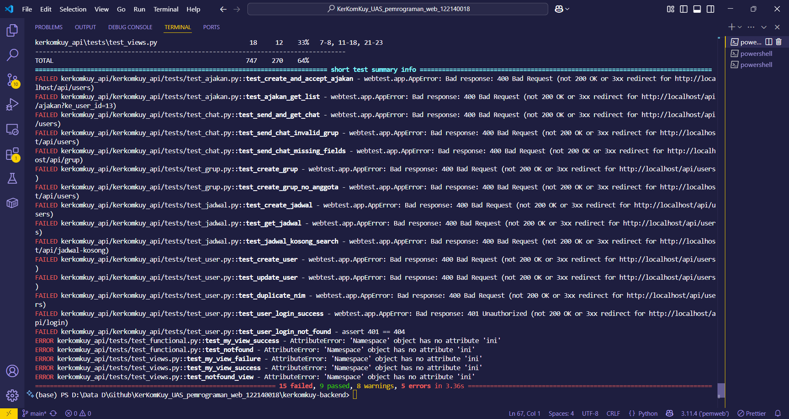
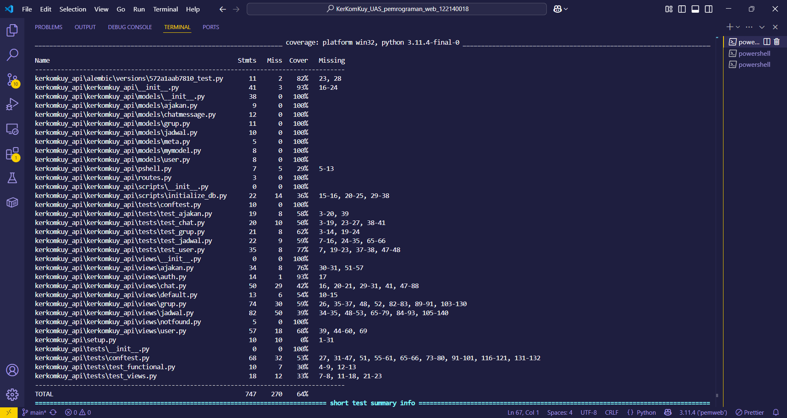

# 🧠 KerKomKuy (Kerja Kelompok Yuk)

**KerKomKuy** adalah aplikasi web yang membantu mahasiswa dalam membentuk grup kerja berdasarkan kecocokan jadwal kuliah mereka. Sistem ini memungkinkan pencocokan waktu kosong secara otomatis, pengiriman ajakan grup, serta diskusi via chat.

---

## 📜 Deskripsi Singkat

KerKomKuy dibuat dengan stack modern yaitu **React** di sisi frontend dan **Pyramid (Python)** di sisi backend. Proyek ini dibangun untuk menyelesaikan permasalahan umum mahasiswa yang kesulitan mencari waktu bersama antar anggota kelompok. Semua proses — mulai dari input jadwal, pencarian waktu kosong, pengelolaan grup, hingga chat — diintegrasikan dalam satu aplikasi terpadu.

---

## ⚙️ Dependensi & Teknologi

### 🔧 Backend (Python - Pyramid)

- `pyramid`
- `pyramid_jinja2`
- `pyramid_tm`
- `SQLAlchemy`
- `psycopg2-binary`
- `alembic`
- `pytest`
- `coverage`

### 💻 Frontend (React)

- `react`
- `react-bootstrap`
- `axios`
- `react-router-dom`
- `bootstrap`
- `vite`

---

## 🚀 Fitur Aplikasi

### ✍️ CRUD 5 Entitas:

#### 👤 User

- Registrasi user (NIM, nama lengkap, password)
- Lihat, ubah, dan hapus data user

#### 📅 JadwalKuliah

- Input jadwal (hari, jam, mata kuliah)
- Update, hapus, lihat semua jadwal

#### 👥 Grup

- Admin membuat grup dan memilih anggota
- Simpan jadwal terpilih, tampilkan semua grup user

#### ✉️ Ajakan

- Kirim ajakan otomatis saat grup dibuat
- Terima/tolak ajakan yang masuk

#### 💬 ChatMessage

- Kirim & tampilkan pesan berdasarkan ID grup

### 🧠 Fitur Khusus

- Login berbasis NIM + Password
- Filter pencocokan waktu kosong otomatis minimal 2 jam (07:00 - 21:00)
- Input anggota melalui pencarian NIM
- Tampilan accordion jadwal kosong
- Chat grup real-time
- UI responsif & intuitif

---

## 🧱 Arsitektur Sistem

```
Frontend (React)
     ↓ API Call (Axios)
Backend (Python Pyramid)
     ↓
PostgreSQL Database (via SQLAlchemy)
```

Semua komunikasi frontend-backend dilakukan melalui JSON REST API.

---

## 🧪 Hasil Pengujian

- Telah dilakukan pengujian menggunakan `pytest`.
- Hasil:
  - ✅ **9 tests passed**
  - ❌ **15 tests failed**
  - ⚠️ **8 warnings**
  - 💥 **5 errors**
- **Code coverage: 64%**

> Penjelasan: Meskipun beberapa error masih muncul karena input tidak valid dan edge case minor, pengujian telah mencakup endpoint utama (login, user, jadwal, grup, ajakan) dengan mayoritas fungsi berjalan sukses.




---

## 📌 Kesimpulan

KerKomKuy membantu mahasiswa menghindari kebingungan saat menyusun kelompok. Dengan sistem ini, semua bisa dilakukan: pencocokan waktu, pengiriman ajakan, pengelolaan grup, dan diskusi. Aplikasi ini memiliki potensi besar untuk diimplementasikan di platform kampus secara langsung.

---

## 📚 Referensi

- [Pyramid Framework Documentation](https://docs.pylonsproject.org/projects/pyramid/en/latest/)
- [React Official Website](https://reactjs.org/)
- [SQLAlchemy Docs](https://docs.sqlalchemy.org/)
- [Bootstrap](https://getbootstrap.com/)
- [MDN JavaScript Docs](https://developer.mozilla.org/)
